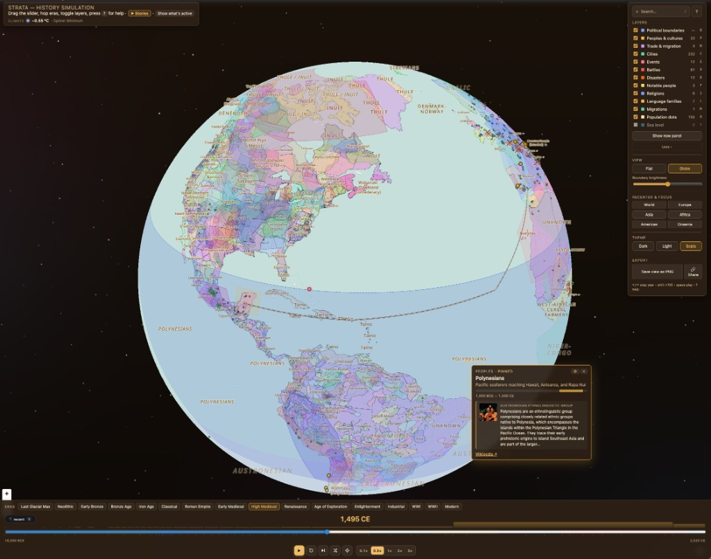
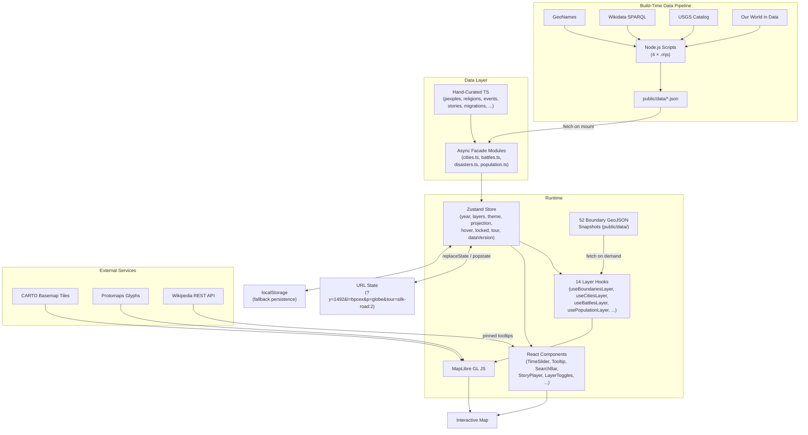

# Strata 🌍

[](https://github.com/dr-nico-f/strata/releases) [](https://github.com/dr-nico-f/strata/actions/workflows/ci.yml) [](LICENSE)

**Interactive Historical World Map** &nbsp; | &nbsp; [**Live Demo**](https://dr-nico-f.github.io/strata/)

Strata lets you explore ~12,000 years of human history on an interactive world map. Scrub a time slider from **10,000 BCE to 2025 CE** and watch thirteen data layers reveal the shifting state of the world — political boundaries, peoples, trade routes, cities, battles, religions, languages, migrations, climate, and more.

Built with **React 18**, **TypeScript**, **MapLibre GL JS 5**, and **Zustand**. No backend — everything is static and deployable anywhere.



---

## 💡 Motivation

History is inherently spatial and layered — empires rise and overlap, trade routes connect distant cultures, migrations reshape demographics, and the physical world itself changes as sea levels shift. But most history resources present this as flat text, isolated maps, or rigid timelines that you can't explore freely.

Strata started as a curiosity: _what would it look like to stack every dimension of history onto a single interactive map and let you scrub through time?_ It grew into a full data visualization project that combines hand-curated editorial content with machine-pulled datasets from Wikidata, GeoNames, USGS, and Our World in Data — blending human judgment with scalable data pipelines.

---

## 🚀 Features

### Map & timeline

- Time slider spanning **10,000 BCE – 2025 CE** with era preset buttons (Last Glacial Max → Modern)
- Tick marks under the slider for every boundary snapshot
- **Play / pause** with configurable playback speed (persisted across sessions)
- **3D Globe** and **flat (Mercator)** projection toggle with idle auto-spin on globe
- **Three themes:** dark, light, and sepia (each with a matching CARTO basemap)
- Starfield background visible through the globe's transparent edges

### Thirteen toggleable layers

| Layer                        | Key | Description                                                                                                                                                       |
| ---------------------------- | --- | ----------------------------------------------------------------------------------------------------------------------------------------------------------------- |
| **Political boundaries**     | `B` | 52 GeoJSON snapshots from [aourednik/historical-basemaps](https://github.com/aourednik/historical-basemaps), snapping to the nearest snapshot ≤ the selected year |
| **Peoples & cultures**       | `P` | 93 hand-authored region polygons (Sumerians, Romans, Mongols, Inca, Polynesians, …)                                                                               |
| **Trade & migration routes** | `N` | 14 polylines — Silk Road, Trans-Saharan, Indian Ocean, Bantu expansion, Polynesian voyages, Atlantic triangular trade, Manila galleon, and more                   |
| **Cities**                   | `C` | Hundreds of cities (curated historical cities with accurate founding dates + GeoNames top-by-population merge), filtered by founded/abandoned dates               |
| **Events**                   | `E` | 75 cultural, political, and scientific milestones, fading in/out around their year                                                                                |
| **Battles**                  | `X` | 920+ decisive battles (curated list + Wikidata SPARQL merge)                                                                                                      |
| **Disasters**                | `D` | Earthquakes, eruptions, tsunamis, pandemics, famines (curated + USGS + Wikidata merge)                                                                            |
| **Notable people**           | `F` | Historical figures positioned at their place of activity                                                                                                          |
| **Religions**                | `I` | Spread of major world religions over time                                                                                                                         |
| **Language families**        | `L` | Geographic extent of language families across eras                                                                                                                |
| **Migrations**               | `M` | Major human migration corridors                                                                                                                                   |
| **Population dots**          | `O` | One dot per ~1 M people scattered across 237 countries (OWID data), scaling from prehistory to today                                                              |
| **Sea level**                | `Y` | 8 paleo-coastline regions (Doggerland, Sundaland, Beringia, Sahul, …) shown before each region's submergence                                                      |

### Interactions

- **Tooltip** follows the cursor with edge-aware positioning and a mini-timeline showing the active range of the hovered feature
- **Click to pin** a feature — shows Wikipedia summary, detail, and a link
- **Multi-layer chooser** popup when a click hits features in two or more layers
- **Country click** → focus mask traces the country outline + optional **country detail panel** (filtered lists of cities, events, battles, people, and disasters within)
- **Bracket keys** `[` / `]` cycle through active features in the pinned layer

### Search & discovery

- **Global search** across all layers and eras — open with `/` or `⌘K`
- **35 curated story tours** with chapter-based narration, camera moves, and layer activation — open with `T`
- **Climate band** at the top of the slider and a temperature anomaly readout in the header
- **Continent presets** for quick recentering and region focus

### Sharing & export

- **URL state sync** — `?y=1492&l=bpcex&p=globe&t=dark&tour=silk-road:2&focus=cities:rome` — views are shareable, the back button works
- **Share button** copies a deep link (including pinned feature focus)
- **Save view as PNG** exports the current map canvas

### ⌨️ Keyboard shortcuts

| Key                         | Action                                 |
| --------------------------- | -------------------------------------- |
| `←` / `→`                   | Step year ±1                           |
| `Shift` + `←/→`             | Step ±100                              |
| `Alt` + `←/→`               | Step ±10                               |
| `Cmd/Ctrl` + `←/→`          | Step ±500                              |
| `Home` / `End`              | Jump to start / end of timeline        |
| `Space`                     | Play / pause                           |
| `G`                         | Toggle globe / flat                    |
| `B P N C E X D F I L M O Y` | Toggle each layer                      |
| `S`                         | Copy share link                        |
| `T`                         | Open/close story tour picker           |
| `H`                         | Hide all UI (screenshot mode)          |
| `R`                         | Jump to a random year                  |
| `?`                         | Open help overlay                      |
| `Shift` + `N`               | Snap to nearest boundary snapshot      |
| `[` / `]`                   | Cycle through active features          |
| `Esc`                       | Dismiss panels / unlock pinned feature |

---

## ⚙️ Setup

```bash
npm install
npm run dev
```

Open <http://localhost:5173>.

### Build for production

```bash
npm run build
```

Outputs a static site to `dist/`.

---

## 🔄 Data pipelines

Some layers merge hand-curated data with live sources pulled by Node scripts:

| Script                     | Source                                | Output                              |
| -------------------------- | ------------------------------------- | ----------------------------------- |
| `npm run build:cities`     | GeoNames cities15000 dump             | `public/data/cities-geonames.json`  |
| `npm run build:battles`    | Wikidata SPARQL                       | `public/data/battles-wikidata.json` |
| `npm run build:disasters`  | USGS earthquake catalog + Wikidata    | `public/data/disasters-live.json`   |
| `npm run build:population` | Our World in Data + restcountries.com | `public/data/population-owid.json`  |

Generated JSON files are committed under `public/data/` so the app builds without running these scripts. At runtime, facade modules in `src/data/` fetch and merge them asynchronously after initial render. Re-run the scripts to pull fresh data.

---

## 🧱 Project layout

```
public/
  data/boundaries/world_*.geojson    # 52 boundary snapshot files
src/
  App.tsx                            # root: mounts map, overlays, lazy panels
  main.tsx                           # React 18 client render
  store.ts                           # Zustand store (all app state)
  index.css                          # global styles + theme CSS variables
  components/
    MapView.tsx                      # MapLibre setup, projection, basemap theming
    TimeSlider.tsx                   # slider + era presets + snapshot ticks + play/pause
    LayerToggles.tsx                 # layer checkboxes, view/theme/export controls
    Tooltip.tsx                      # cursor-following tooltip with mini-timeline
    SearchBar.tsx                    # global search across layers and eras
    StoryPicker.tsx                  # story tour browser by era
    StoryPlayer.tsx                  # narrated tour playback with chapter navigation
    HelpOverlay.tsx                  # keyboard shortcuts and feature reference
    CountryDetailPanel.tsx           # filtered lists for a focused country
    ClimateBand.tsx                  # temperature anomaly gradient above the slider
    StarField.tsx                    # starfield behind the globe
    ShareButton.tsx                  # copy shareable URL
    LayerChoicePopup.tsx             # multi-layer click disambiguator
    NowPanel.tsx                     # summary of active features at current year
    BackBreadcrumb.tsx               # recent-year navigation breadcrumb
    CityPopulationSparkline.tsx      # inline sparkline for city population tooltip
  layers/
    useBoundariesLayer.ts            # political boundary polygons
    usePeoplesLayer.ts               # peoples & cultures regions
    useConnectionsLayer.ts           # trade & migration polylines
    useCitiesLayer.ts                # city markers with population curves
    useEventsLayer.ts                # event markers
    useBattlesLayer.ts               # battle markers
    useDisastersLayer.ts             # disaster markers (earthquakes, eruptions, …)
    usePeopleLayer.ts                # notable people markers
    useReligionsLayer.ts             # religion spread fills
    useLanguagesLayer.ts             # language family fills
    useMigrationsLayer.ts            # migration corridor lines
    usePopulationLayer.ts            # population dot scatter
    useSeaLevelLayer.ts              # paleo-coastline polygons
    useFocusMaskLayer.ts             # dim-mask for country/region focus
  data/
    boundariesManifest.ts            # snapshot year → filename mapping
    eras.ts                          # era preset definitions
    stories.ts                       # 35 curated story tours
    climate.ts                       # temperature anomaly reconstruction
    peoples.ts                       # 93 culture/people polygons
    connections.ts                   # 14 trade/migration routes
    events.ts                        # 75 historical events
    cities.curated.ts                # hand-curated cities with founding dates
    cities.ts                        # async facade (curated + GeoNames JSON)
    battles.curated.ts               # hand-curated battles
    battles.ts                       # async facade (curated + Wikidata JSON)
    disasters.curated.ts             # hand-curated disasters
    disasters.ts                     # async facade (curated + USGS/Wikidata JSON)
    population.ts                    # async facade (OWID JSON)
    loadAllGenerated.ts              # orchestrator — fetches all JSON, bumps dataVersion
    people.ts                        # notable historical figures
    religions.ts                     # religion spread data
    religions.modern.ts              # modern religion polygons
    languages.ts                     # language family data
    migrations.ts                    # migration corridors
    sealevel.ts                      # 8 paleo-coastline regions
  utils/
    urlState.ts                      # ?y= ?l= ?p= ?t= ?tour= ?focus= encode/decode
    useUrlSync.ts                    # syncs store ↔ URL
    useFocusFromUrl.ts               # restores pinned feature from ?focus=
    useKeyboard.ts                   # global keyboard shortcuts
    useWikipediaSummary.ts           # client-side Wikipedia REST fetch
    searchIndex.ts                   # cross-layer search index
    activeCounts.ts                  # per-layer active feature counts
    localState.ts                    # localStorage persistence
    mapInstance.ts                   # shared MapLibre instance ref
    pickSnapshot.ts                  # nearest-snapshot selector
    colorHash.ts                     # deterministic color from string
    continents.ts                    # continent bounding boxes + presets
    density.ts                       # population density helpers
    antLine.ts                       # animated dashed-line effect
    useDeferredYear.ts               # deferred year for expensive layers
scripts/
  build-cities.mjs                   # GeoNames → public/data/cities-geonames.json
  build-battles.mjs                  # Wikidata → public/data/battles-wikidata.json
  build-disasters.mjs                # USGS + Wikidata → public/data/disasters-live.json
  build-population.mjs               # OWID + restcountries → public/data/population-owid.json
```

---

## 🏗️ Architecture



**Data flows in two phases.** At build time, Node scripts pull from external APIs (GeoNames, Wikidata, USGS, OWID) and write JSON files to `public/data/`. At runtime, the app renders immediately with hand-curated data, then async facade modules fetch and merge the generated JSON datasets — bumping a `dataVersion` counter in the Zustand store so layer hooks and components re-render progressively. The store drives 14 independent layer hooks, each subscribing to `year`, `layers`, and `dataVersion`, projecting its dataset into GeoJSON sources on the MapLibre map. Boundary snapshots are fetched on demand. The store also syncs bidirectionally with the URL for shareable deep links and with `localStorage` for session persistence.

---

## 🛠️ Tech stack

|                  |                                                                    |
| ---------------- | ------------------------------------------------------------------ |
| **UI**           | React 18                                                           |
| **State**        | Zustand                                                            |
| **Map**          | MapLibre GL JS 5.x (Mercator + globe projection)                   |
| **Basemap**      | CARTO raster tiles (dark / light / sepia)                          |
| **Glyphs**       | Protomaps PBF for boundary labels                                  |
| **Language**     | TypeScript (strict)                                                |
| **Build**        | Vite 5                                                             |
| **Data sources** | GeoNames, Wikidata SPARQL, USGS, Our World in Data, Wikipedia REST |

---

## 📝 Attribution

- Boundary GeoJSONs: [aourednik/historical-basemaps](https://github.com/aourednik/historical-basemaps) (CC BY-SA 4.0)
- Basemap tiles: [OpenStreetMap](https://www.openstreetmap.org/copyright) contributors / [CARTO](https://carto.com/attributions)
- Map renderer: [MapLibre GL JS](https://maplibre.org/)
- City data: [GeoNames](https://www.geonames.org/) (CC BY 4.0)
- Battle & disaster data: [Wikidata](https://www.wikidata.org/) (CC0)
- Earthquake data: [USGS](https://earthquake.usgs.gov/) (public domain)
- Population data: [Our World in Data](https://ourworldindata.org/grapher/population) (CC BY 4.0), combining HYDE v3.3, Gapminder, and UN WPP
- Country metadata: [restcountries.com](https://restcountries.com/) (MPL 2.0)

---

## 📜 License

MIT © 2025–2026 — Created by Nico
